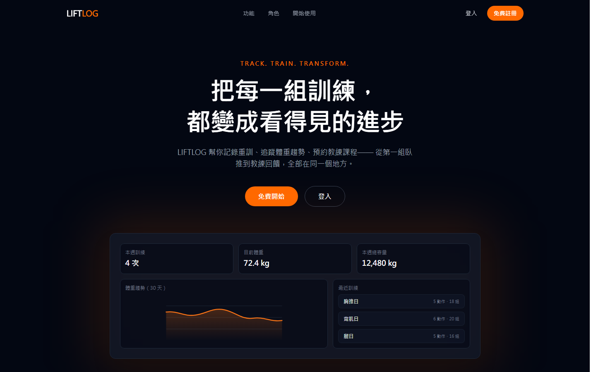
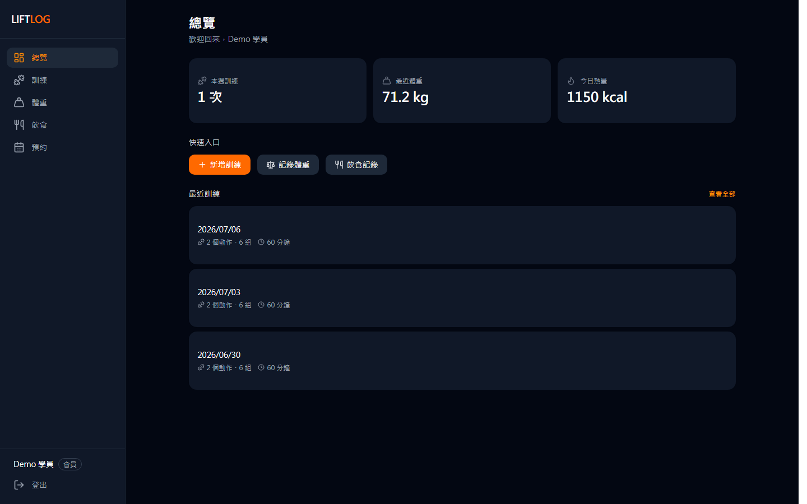
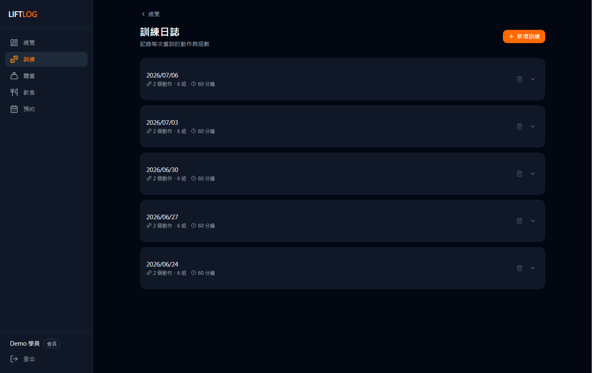
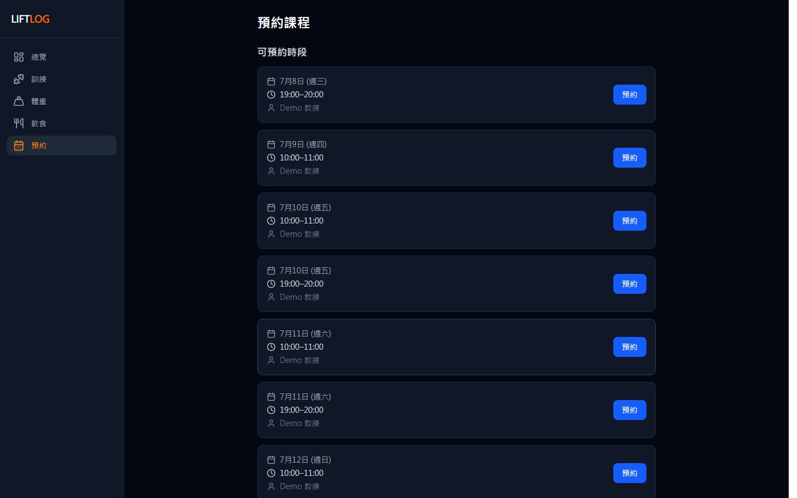
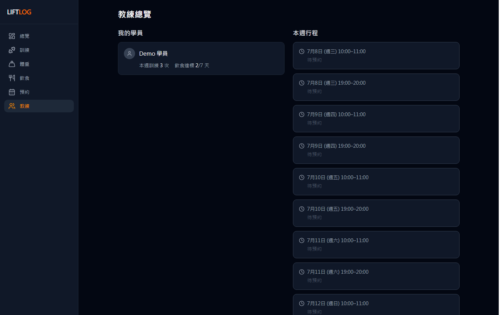
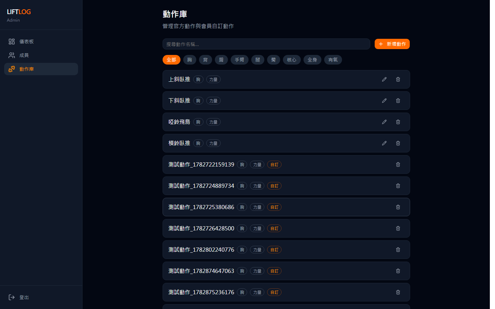

# LIFTLOG — 健身追蹤平台

> Track. Train. Transform. 把每一組訓練，都變成看得見的進步。

重訓記錄、飲食追蹤、體重趨勢、教練預約——一個涵蓋「學員 × 教練 × 管理員」三種角色的全端健身平台，採 Spec-Driven Development（SDD）流程開發。

**🔗 Live Demo：<https://fitness-tracker-mu-umber.vercel.app>**

## 立即試用（Demo 帳號）

免註冊，登入就能看到完整示範資料：

| 角色 | Email | 密碼 | 看什麼 |
|------|-------|------|--------|
| 🏋️ 學員 | `demo-member@example.com` | `demo1234` | 訓練/飲食/體重記錄、預約教練課程 |
| 📋 教練 | `demo-coach@example.com` | `demo1234` | 學員總覽、開放時段、審核預約 |
| ⚙️ 管理員 | `demo-admin@example.com` | `demo1234` | 成員管理、動作庫、操作稽核 |

## 畫面

| | |
|---|---|
|  |  |
| 產品首頁 | 學員總覽——本週訓練、體重、熱量 |
|  |  |
| 訓練記錄——動作、組數、重量 | 課程預約——選擇教練開放時段 |
|  |  |
| 教練總覽——學員狀態與本週行程 | 管理後台——動作庫管理 |

## 功能

**學員**
- 重訓記錄：動作選擇器、組數/重量/次數、整組複製、自訂動作
- 飲食追蹤：每日三餐熱量與蛋白質、每日摘要
- 體重趨勢：體重/體脂/肌肉量記錄與圖表
- 課程預約：瀏覽教練開放時段 → 預約 → 等待教練審核

**教練**
- 學員總覽：本週訓練次數、飲食達標天數
- 時段管理：開放可預約時段
- 預約審核：核准/拒絕學員預約（含審核時限與過期機制）

**管理員**
- 成員管理：角色調整（會員 ⇄ 教練）、教練-學員配對
- 動作庫管理：內建動作 CRUD
- 稽核記錄：資料異動追蹤（誰、何時、改了什麼）

## 技術棧

| 層級 | 技術 |
|------|------|
| Framework | Next.js 16（App Router、TypeScript、React 19） |
| UI | Tailwind CSS v4 + shadcn/ui + Recharts |
| Database | Supabase（PostgreSQL）+ Prisma 7 |
| Auth | Supabase Auth（JWT session cookie） |
| Forms | react-hook-form + zod |
| Testing | Vitest + React Testing Library + Playwright（16 支 E2E spec） |
| Deploy | Vercel |

## 架構亮點

- **Prisma 與 Supabase client 的分工**：開發環境封鎖 5432/6543 port，無法直連資料庫。因此 Prisma 只負責 schema 定義與型別生成，runtime 查詢全部走 Supabase JS client（HTTPS）。schema 變更流程見 [`docs/schema-migration.md`](docs/schema-migration.md)。
- **預約狀態機**：`PENDING → CONFIRMED / REJECTED / EXPIRED / CANCELLED`。待審核的過期死線在建立當下凍結：`min(now + 審核時限, 開課時間 − 預約截止緩衝)`，重新預約時重用 terminal state 的資料列避免 slot 唯一性衝突。
- **角色權限**：`USER / ADMIN`（系統層）× `OWNER / ADMIN / COACH / MEMBER`（組織層）雙層角色。Middleware 保護路由，每支 API 各自驗證身份並隔離 `userId` 資料。
- **稽核記錄**：DB trigger 自動記錄關鍵資料表的 INSERT/UPDATE/DELETE 與操作者。
- **auth.users 同步**：Supabase Auth 建立使用者時，trigger 自動同步到 `public.User`。

## 開發流程：Spec-Driven Development

本專案以 [OpenSpec](https://github.com/Fission-AI/OpenSpec) 實踐 SDD，搭配 AI 協作開發：

```
/opsx:propose → 產出 proposal / design / specs / tasks
/opsx:apply   → 依 tasks 實作，逐項打勾
/opsx:archive → 歸檔 change、同步 delta specs 到主 specs
```

24 個功能 spec 全數留存於 [`openspec/specs/`](openspec/specs/)，每個功能的設計決策可追溯。

## 本地開發

```bash
npm install
cp .env.local.example .env.local   # 填入 Supabase 專案金鑰

npm run dev                        # http://localhost:3000
npm run seed                       # 內建動作庫種子資料
npx tsx prisma/seed-demo.ts        # demo 帳號與示範資料
npm run test:e2e                   # Playwright E2E
```

環境變數見 `.env.local.example`；資料庫初始化 SQL 見 [`supabase/setup.sql`](supabase/setup.sql)。
